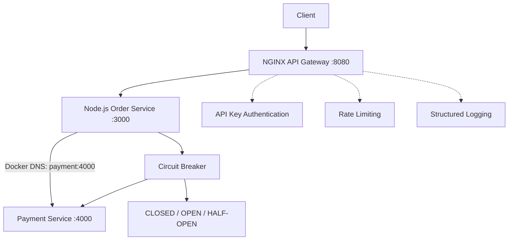

# Day 21 - API Gateway Architecture

## Architecture Diagram

```mermaid
flowchart TD
    C["Client"]
    G["NGINX API Gateway :8080"]
    W["Node.js Order Service :3000"]
    P["Payment Service :4000"]

    C --> G
    G --> W
    W -->|"Docker DNS: payment:4000"| P

    G -.-> A["API Key Authentication"]
    G -.-> R["Rate Limiting"]
    G -.-> L["Structured Logging"]

    W --> CB["Circuit Breaker"]
    CB --> S["CLOSED / OPEN / HALF-OPEN"]
    CB --> P
```
